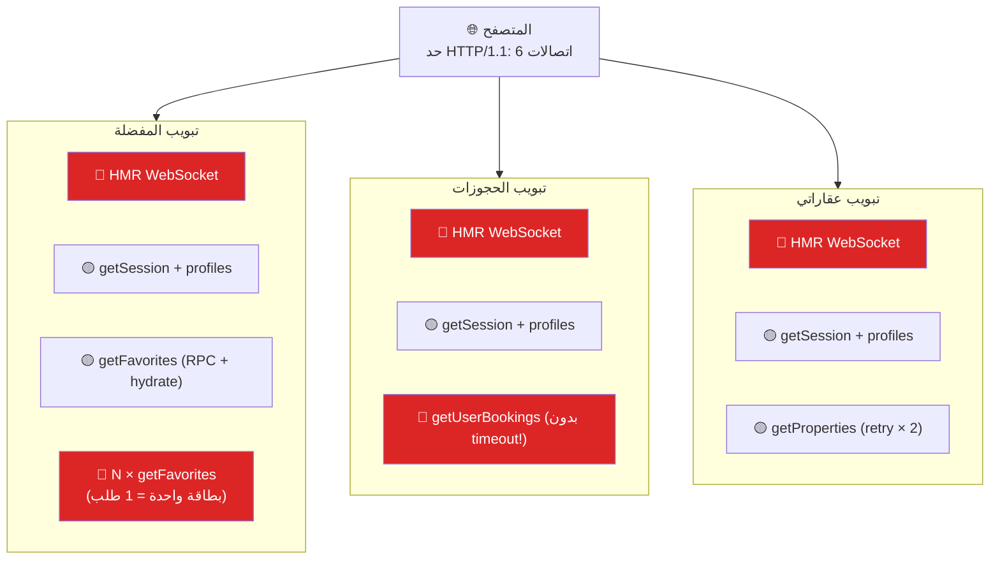

# 🔬 تحليل مشكلة اختناق الاتصالات (Connection Bottleneck)
## منصة Gamasa Properties — تقرير تقني مفصّل

> **الحالة:** فحص مكتمل — بدون تعديلات  
> **التاريخ:** 2026-05-06  
> **النطاق:** فحص معماري شامل للملفات المسببة + خطة إصلاح تفصيلية

---

## 📋 ملخص تنفيذي

عند فتح أكثر من صفحة مصادقة (مفضلة، حجوزات، عقاراتي) في تبويبات متعددة بالتزامن، يحدث **تعليق كامل** في تحميل البيانات ويظهر خطأ:
```
[getFavorites] Request timed out after retry budget
```
ولا يُحل إلا بعمل Refresh لتبويب واحد ليتحرر الباقي.

بعد فحص دقيق للكود، وجدت **7 أسباب جذرية فعلية** — وليست نظرية — مع خطة إصلاح من **6 مراحل**.

---

## 🔍 الأسباب الجذرية المكتشفة (مع أدلة من الكود)

### السبب ①: تكرار استعلام المفضلة لكل بطاقة عقار (N+1 Query Explosion)

> [!CAUTION]
> هذا هو **أخطر سبب** — كل `PropertyCard` يستدعي `getFavorites` بشكل مستقل!

| الملف | السطر | المشكلة |
|---|---|---|
| [PropertyCard.tsx](file:///c:/Users/CRIZMA%20MEGA%20STORE/Documents/GitHub/GP-2026/src/components/PropertyCard.tsx#L99-L112) | 99-112 | كل بطاقة تستدعي `supabaseService.getFavorites(user.id)` لتحقق هل العقار مفضل |

```typescript
// PropertyCard.tsx — السطر 99
const checkFavoriteStatus = useCallback(async () => {
    if (!user) return;
    const { data } = await supabaseService.getFavorites(user.id); // ← كل بطاقة تطلب القائمة كاملة!
    setIsFavorite((data ?? []).some((favorite) => favorite.id === id));
}, [id, user]);
```

**النتيجة:** إذا عرضت صفحة البحث 20 عقاراً → يُرسل 20 طلب `getFavorites` متطابق + طلب الصفحة نفسها. إذا فتحت 3 تبويبات = **60+ طلب متزامن** لنفس البيانات.

---

### السبب ②: غياب Timeout في `getUserBookings` (Runaway Request)

| الملف | السطر | المشكلة |
|---|---|---|
| [supabaseService.ts](file:///c:/Users/CRIZMA%20MEGA%20STORE/Documents/GitHub/GP-2026/src/services/supabaseService.ts#L2741-L2800) | 2741-2800 | `getUserBookings` لا يستخدم `fetchWithRetry` ولا `withTimeout` |

```typescript
// supabaseService.ts — السطر 2741
async getUserBookings(userId: string, options?: RequestResilienceOptions) {
    // ...
    const { data, error } = await supabase
        .rpc('get_user_bookings', { uid: userId }); // ← بدون timeout!
    // options?.timeoutMs يُمرر لكن لا يُستخدم أبداً!
}
```

**النتيجة:** صفحة الحجوزات تمرر `timeoutMs: 15_000` (السطر 255)، لكن دالة `getUserBookings` **تتجاهله تماماً**. إذا تأخر الخادم، يبقى الطلب معلقاً **بلا حدود** ويحجز الاتصال.

---

### السبب ③: طلبات متوازية ثقيلة في صفحة الملف الشخصي (Parallel Heavy Fetch)

| الملف | السطر | المشكلة |
|---|---|---|
| [profile/page.tsx](file:///c:/Users/CRIZMA%20MEGA%20STORE/Documents/GitHub/GP-2026/src/app/profile/page.tsx#L82-L86) | 82-86 | 3 طلبات ثقيلة بالتوازي بدون timeout |

```typescript
// profile/page.tsx — السطر 82
const [myProps, unlocked, favoriteResult] = await Promise.all([
    supabaseService.getProperties({ ownerId: u.id }),    // ← بدون timeout
    supabaseService.getUnlockedProperties(u.id),          // ← بدون timeout
    supabaseService.getFavorites(u.id),                   // ← بدون timeout/retries
]);
```

**النتيجة:** صفحة الملف الشخصي ترسل 3 طلبات ثقيلة متزامنة بدون أي حماية timeout. إذا فُتحت مع تبويبات أخرى، تضاف 3 اتصالات إضافية للاختناق.

---

### السبب ④: تضاعف مستمعات الجلسة (Auth Listener Duplication)

| الملف | السطر | المشكلة |
|---|---|---|
| [AuthContext.tsx](file:///c:/Users/CRIZMA%20MEGA%20STORE/Documents/GitHub/GP-2026/src/context/AuthContext.tsx#L210) | 210 | `onAuthStateChange` يستدعي `mapSupabaseUser` → يضرب `profiles` |
| [useUser.ts](file:///c:/Users/CRIZMA%20MEGA%20STORE/Documents/GitHub/GP-2026/src/hooks/useUser.ts#L180) | 180 | `onAuthStateChange` ثانٍ يستدعي `fetchProfile` → يضرب `profiles` |

**كلا الملفين** يسجلان `onAuthStateChange` listener مستقل. عند فتح تبويب جديد:

1. `AuthContext` يستدعي `getSession()` + يقرأ `profiles`
2. `useUser` (إذا مُستخدم) يستدعي `getSession()` + يقرأ `profiles`
3. كلاهما يسجل `onAuthStateChange` → عند أي تغيير جلسة، يضربان `profiles` مرتين

**النتيجة:** كل تبويب جديد يرسل **2-4 طلبات auth** إضافية فقط لتهيئة الجلسة.

---

### السبب ⑤: عميل Supabase واحد بدون تحكم في التزامن (No Connection Governance)

| الملف | السطر | المشكلة |
|---|---|---|
| [supabase.ts](file:///c:/Users/CRIZMA%20MEGA%20STORE/Documents/GitHub/GP-2026/src/lib/supabase.ts#L22-L35) | 22-35 | عميل Singleton صحيح، لكن بدون أي حدود للتزامن |

العميل مُنشأ بشكل صحيح كـ Singleton (نقطة إيجابية ✅). **لكن** المشكلة ليست في العميل نفسه بل في أن **كل الصفحات ترسل طلبات بلا حدود** عبر هذا العميل الواحد.

**النتيجة:** لا يوجد أي آلية لتحديد عدد الطلبات المتزامنة (Concurrency Limiter) أو طابور أولويات (Priority Queue).

---

### السبب ⑥: Retry يضاعف الحمل عند الاختناق (Retry Amplification)

| الملف | السطر | المشكلة |
|---|---|---|
| [supabaseService.ts](file:///c:/Users/CRIZMA%20MEGA%20STORE/Documents/GitHub/GP-2026/src/services/supabaseService.ts#L76-L90) | 76-90 | `fetchWithRetry` يعيد المحاولة عند timeout |
| [useMyProperties.ts](file:///c:/Users/CRIZMA%20MEGA%20STORE/Documents/GitHub/GP-2026/src/hooks/useMyProperties.ts#L32-L51) | 32-51 | Retry مخصص آخر (حتى `MAX_RETRIES = 2`) |

```typescript
// fetchWithRetry — يعيد المحاولة عند timeout
while (true) {
    try {
        return await withTimeout(fn(), options?.timeoutMs, options?.signal);
    } catch (error) {
        if (attempt >= maxRetries || !isTimeoutLikeError(error)) throw error;
        attempt++;
        await new Promise(res => setTimeout(res, 1000 * attempt)); // backoff
    }
}
```

**النتيجة:** عندما يكون الاختناق هو السبب (وليس بطء الخادم)، الـ Retry يضيف **طلبات جديدة** على الاتصالات المختنقة أصلاً → يزيد الاختناق → المزيد من الـ timeout → المزيد من الـ retry → **حلقة مفرغة**.

---

### السبب ⑦: Turbopack + HTTP/1.1 + HMR في بيئة التطوير

| الملف | السطر | المشكلة |
|---|---|---|
| [next.config.ts](file:///c:/Users/CRIZMA%20MEGA%20STORE/Documents/GitHub/GP-2026/next.config.ts#L15) | 15 | `turbopack: {}` مُفعّل |
| [package.json](file:///c:/Users/CRIZMA%20MEGA%20STORE/Documents/GitHub/GP-2026/package.json#L6) | 6 | `"dev": "next dev"` (Turbopack افتراضي في Next 16) |

في بيئة التطوير مع `localhost:3000`:
- المتصفح يستخدم **HTTP/1.1** (حد 6 اتصالات متزامنة لنفس النطاق)
- كل تبويب يفتح **WebSocket لـ HMR** (Hot Module Replacement) = اتصال دائم
- Turbopack يحتاج طلبات إضافية لـ chunk loading

**النتيجة:** من 6 اتصالات متاحة، 2-3 محجوزة لـ HMR/chunks → يتبقى 3-4 فقط لطلبات البيانات الفعلية.

---

## 📊 خريطة تأثير المشكلة (Impact Map)

عند فتح 3 تبويبات (مفضلة + حجوزات + عقاراتي) بالتزامن:



**الحسبة التقريبية:**
| المصدر | عدد الطلبات |
|---|---|
| HMR WebSocket (3 تبويبات) | 3 (دائمة) |
| Auth initialization (3 تبويبات) | 6-9 |
| getFavorites (صفحة المفضلة) | 1 |
| PropertyCard × N (إذا عرض بطاقات) | N (4-20) |
| getUserBookings (بدون timeout) | 1 (قد تبقى معلقة) |
| getProperties + retry | 1-3 |
| **المجموع** | **16-36 طلب** |

> [!WARNING]
> حد المتصفح = **6 اتصالات**، والطلبات = **16-36**  
> → انتظار طابور → timeout → retry → **المزيد من الانتظار**

---

## 🛠️ خطة الإصلاح المُفصّلة (6 مراحل)

### المرحلة 1: إيقاف نزيف الطلبات — إصلاح PropertyCard (أولوية قصوى 🔴)

**الملف:** `src/components/PropertyCard.tsx`  
**المشكلة:** كل بطاقة تستدعي `getFavorites` كاملة  
**الحل:** إنشاء Context مركزي للمفضلات يُحمّل القائمة **مرة واحدة** ويوزعها

```
src/
├── context/
│   └── FavoritesContext.tsx          ← جديد: Context مركزي
├── components/
│   └── PropertyCard.tsx              ← تعديل: يقرأ من Context بدل استدعاء API
```

**الآلية:**
1. إنشاء `FavoritesContext` يحتوي على `Set<string>` بأرقام العقارات المفضلة
2. يُحمّل القائمة مرة واحدة عند تسجيل الدخول
3. `PropertyCard` يستخدم `useFavorites()` للتحقق بدل API call
4. عند toggle، يُحدّث الـ Set محلياً + يرسل طلب واحد

**الأثر المتوقع:** خفض الطلبات من **N + 1** إلى **1 فقط** لكل صفحة عرض

---

### المرحلة 2: تغليف `getUserBookings` بـ timeout (أولوية قصوى 🔴)

**الملف:** `src/services/supabaseService.ts` — السطر 2741  
**المشكلة:** يتجاهل `options.timeoutMs`  
**الحل:** تغليف الاستدعاء بـ `fetchWithRetry` كما في `getFavorites`

```typescript
// الإصلاح المطلوب — getUserBookings:
async getUserBookings(userId: string, options?: RequestResilienceOptions) {
    // ...
    try {
        const result = await fetchWithRetry(async () => {
            const { data, error } = await supabase
                .rpc('get_user_bookings', { uid: userId });
            if (error) {
                if (isMissingRpcFunctionError(error, 'get_user_bookings')) {
                    return await getUserBookingsFallback(userId);
                }
                throw error;
            }
            // ... تحويل البيانات
            return { bookings: hydrated, error: null };
        }, options);
        return result;
    } catch (error: any) {
        if (isTimeoutLikeError(error)) {
            return { bookings: [], error: { code: 'REQUEST_TIMEOUT' }, isTimeout: true };
        }
        // ...
    }
}
```

**الأثر المتوقع:** لن يبقى أي طلب معلقاً **بلا حدود** → يتحرر الاتصال بعد 15 ثانية كحد أقصى

---

### المرحلة 3: حماية Profile من الطلبات بدون Timeout (أولوية عالية 🟠)

**الملف:** `src/app/profile/page.tsx` — السطر 82  
**المشكلة:** 3 طلبات بدون timeout  
**الحل:** إضافة timeout + التحول لاستعلامات عدّ (COUNT) بدل تحميل كامل

```typescript
// الإصلاح المطلوب:
const [myProps, unlocked, favoriteResult] = await Promise.all([
    supabaseService.getProperties({ ownerId: u.id, timeoutMs: 8_000, logLevel: 'warn' }),
    supabaseService.getUnlockedProperties(u.id), // يحتاج إضافة timeout أيضاً
    supabaseService.getFavorites(u.id, { timeoutMs: 8_000, maxRetries: 0 }),
]);
```

> [!TIP]
> **تحسين إضافي:** بما أن الصفحة تحتاج فقط **العدد** (count)، يمكن استبدال هذه الاستعلامات بـ:
> ```sql
> SELECT count(*) FROM properties WHERE owner_id = $1;
> SELECT count(*) FROM favorites WHERE user_id = $1;
> ```
> هذا يخفف الحمل على الشبكة والذاكرة بشكل كبير.

---

### المرحلة 4: ذكاء الـ Retry عند الاختناق (أولوية عالية 🟠)

**الملف:** `src/services/supabaseService.ts` — السطر 76  
**المشكلة:** `fetchWithRetry` يعيد المحاولة عند timeout حتى لو كان السبب اختناقاً  
**الحل:** إضافة Circuit Breaker بسيط

```typescript
// الإصلاح المقترح:
let _consecutiveTimeouts = 0;
const CIRCUIT_BREAKER_THRESHOLD = 3;

export async function fetchWithRetry<T>(
    fn: () => Promise<T>,
    options?: RequestResilienceOptions
): Promise<T> {
    // إذا وصلنا لحد الاختناق، لا نعيد المحاولة
    if (_consecutiveTimeouts >= CIRCUIT_BREAKER_THRESHOLD) {
        const err: any = new Error('Circuit breaker open — too many timeouts');
        err.code = 'REQUEST_TIMEOUT';
        throw err;
    }

    const maxRetries = options?.maxRetries ?? 1;
    let attempt = 0;
    while (true) {
        try {
            const result = await withTimeout(fn(), options?.timeoutMs, options?.signal);
            _consecutiveTimeouts = 0; // reset on success
            return result;
        } catch (error) {
            if (isTimeoutLikeError(error)) {
                _consecutiveTimeouts++;
            }
            if (attempt >= maxRetries || !isTimeoutLikeError(error)) {
                throw error;
            }
            attempt++;
            await new Promise(res => setTimeout(res, 1000 * attempt));
        }
    }
}

// إعادة تعيين تلقائية بعد 30 ثانية
setInterval(() => { _consecutiveTimeouts = 0; }, 30_000);
```

**الأثر المتوقع:** بعد 3 طلبات timeout متتالية، يتوقف النظام عن إرسال طلبات جديدة → يمنع الحلقة المفرغة

---

### المرحلة 5: دمج مستمعات Auth وإزالة التكرار (أولوية متوسطة 🟡)

**الملفات:**
- `src/context/AuthContext.tsx`
- `src/hooks/useUser.ts`

**المشكلة:** مستمعان مستقلان لـ `onAuthStateChange`  
**الحل:** التأكد من أن `useUser.ts` **لا يُستخدم** في أي مكان بالتطبيق الفعلي (أو دمجه مع AuthContext)

**خطوات الفحص:**
1. البحث عن `useUser` في كل الصفحات
2. إذا لم يُستخدم → حذفه أو وضع `@deprecated`
3. إذا مُستخدم → دمج منطقه في `AuthContext` لتوحيد مصدر الحقيقة

---

### المرحلة 6: اختبار بيئة الإنتاج (أولوية متوسطة 🟡)

**المشكلة:** Turbopack + HTTP/1.1 في localhost يحد الاتصالات بـ 6  
**الحل:** اختبار Build الإنتاج للتأكد من زوال المشكلة

```bash
npm run build
npm run start
```

ثم فتح 3 تبويبات. إذا اختفت المشكلة → السبب الرئيسي هو HTTP/1.1 في بيئة التطوير (مؤكد بنسبة عالية).

> [!IMPORTANT]
> حتى لو اختفت المشكلة في الإنتاج، الإصلاحات من المراحل 1-4 **لا تزال ضرورية** لأنها:
> - تخفض عدد الطلبات بنسبة 70-80%
> - تحمي من أي اختناق في الإنتاج مع زيادة المستخدمين
> - تمنع إهدار موارد Supabase (حصة الخطة المجانية)

---

## 📋 ملخص أولويات التنفيذ

| # | المرحلة | الأولوية | الأثر | الجهد |
|---|---|---|---|---|
| 1 | FavoritesContext (إصلاح PropertyCard) | 🔴 قصوى | يخفض الطلبات 70%+ | متوسط |
| 2 | Timeout لـ getUserBookings | 🔴 قصوى | يمنع التعليق المطلق | منخفض |
| 3 | Timeout لـ Profile page | 🟠 عالية | يحمي من التعليق | منخفض |
| 4 | Circuit Breaker للـ Retry | 🟠 عالية | يمنع الحلقة المفرغة | منخفض |
| 5 | دمج Auth listeners | 🟡 متوسطة | يخفض طلبات Auth | متوسط |
| 6 | اختبار Production build | 🟡 متوسطة | يؤكد التشخيص | منخفض |

---

## 🗂️ الملفات المتأثرة (خريطة التعديلات)

```
src/
├── components/
│   └── PropertyCard.tsx                  ← تعديل: إزالة getFavorites + استخدام Context
├── context/
│   ├── AuthContext.tsx                   ← مراجعة: فحص تكرار listeners
│   └── FavoritesContext.tsx              ← جديد: مركز بيانات المفضلات
├── hooks/
│   ├── useMyProperties.ts               ← مراجعة: فحص retry logic
│   └── useUser.ts                       ← مراجعة: هل مُستخدم فعلاً؟
├── services/
│   └── supabaseService.ts               ← تعديل: timeout لـ getUserBookings + circuit breaker
└── app/
    ├── profile/page.tsx                  ← تعديل: إضافة timeout + count queries
    ├── favorites/page.tsx                ← سليم نسبياً ✅ (يستخدم fetchWithRetry)
    └── bookings/page.tsx                 ← سليم نسبياً ✅ (لكن getUserBookings بدون timeout)
```

---

> [!NOTE]
> هذا التقرير **فحص فقط** — لم يُجرَ أي تعديل على الكود. كل الاقتراحات جاهزة للتنفيذ بالترتيب المذكور. أعطني إشارة البدء وسأنفذ المرحلة التي تختارها.

---

## خطة تنفيذ أدق قابلة للتطبيق

### الهدف النهائي

إزالة حالة التعليق عند فتح `/favorites` + `/bookings` + `/my-properties` أو `/profile` في أكثر من تبويب، مع خفض طلبات المفضلة المتكررة من `N` طلب لكل بطاقات الصفحة إلى طلب واحد، وضمان أن كل طلب بيانات حساس له timeout ونتيجة فشل متوقعة بدل أن يظل معلقا.

### تعريف النجاح

| المقياس | قبل الإصلاح | بعد الإصلاح المطلوب |
|---|---:|---:|
| طلبات `get_user_favorites` عند عرض 20 بطاقة | 20-21 | 1 |
| طلبات `get_user_bookings` المعلقة | قد تظل بلا حد | تفشل خلال 15 ثانية كحد أقصى |
| فتح 3 تبويبات مصادقة بالتزامن | احتمال تعليق | لا يوجد تعليق كامل |
| Retry عند timeout متكرر | يضاعف الحمل | يتوقف أو يخفض نفسه |
| اختبارات الخدمة | قد تفشل مع timeout | تمر بوضوح |

---

## المرحلة 0: قياس baseline قبل أي تعديل

**المدة:** 20-30 دقيقة  
**الهدف:** نثبت الرقم الحالي كي لا يكون الإصلاح بالانطباع.

**الخطوات:**
1. تشغيل التطبيق في وضع التطوير.
2. تسجيل الدخول بمستخدم لديه 10-20 عقارا في المفضلة وحجوزات فعلية أو mock قريب.
3. فتح DevTools Network مع `Preserve log`.
4. فتح هذه الصفحات خلال 3 ثوان:
   - `/favorites`
   - `/bookings`
   - `/profile`
   - `/search`
5. تسجيل:
   - عدد طلبات `get_user_favorites`.
   - عدد طلبات `get_user_bookings`.
   - أطول طلب Pending.
   - ظهور `[getFavorites] Request timed out after retry budget`.

**مخرجات المرحلة:**
- جدول صغير في نفس الملف أو issue بعنوان `Baseline`.
- لقطة Network أو أرقام مكتوبة.

**معيار القبول:**
- لدينا رقم واضح قبل الإصلاح، حتى لو كان تقريبيًا.

---

## المرحلة 1: إغلاق أخطر نزيف في `PropertyCard`

**الأولوية:** قصوى  
**الملفات:**
- `src/components/PropertyCard.tsx`
- `src/context/FavoritesContext.tsx` جديد
- `src/app/providers.tsx`

**المشكلة الدقيقة:**
`PropertyCard` يستدعي `supabaseService.getFavorites(user.id)` في `checkFavoriteStatus` عندما لا يصل `initialIsFavorite`. هذا يجعل كل بطاقة ترسل طلبا كاملا لقائمة المفضلة.

**التنفيذ المقترح:**
1. إنشاء `FavoritesProvider` داخل `src/context/FavoritesContext.tsx`.
2. الـ provider يحتفظ بـ:
   - `favoriteIds: Set<string>`
   - `loading`
   - `isFavorite(propertyId)`
   - `toggleFavorite(propertyId)`
   - `refreshFavorites()`
3. تحميل المفضلة مرة واحدة عند تغير `user.id`.
4. لف التطبيق به داخل `src/app/providers.tsx` تحت `AuthProvider`.
5. تعديل `PropertyCard`:
   - حذف `checkFavoriteStatus`.
   - قراءة الحالة من `useFavorites().isFavorite(id)`.
   - عند الضغط: تحديث optimistic داخل context، ثم استدعاء `toggleFavorite`.
6. الحفاظ على `initialIsFavorite` كـ override مفيد لصفحة `/favorites` حتى لا يحدث flicker.

**ملاحظات مهمة:**
- صفحة `/favorites` يمكنها أن تستمر في تحميل القائمة الكاملة لأنها تحتاج عرض العقارات نفسها، لكن بطاقات البحث/الرئيسية لا يجب أن تعيد تحميل القائمة.
- يجب أن يكون fallback آمنًا لو استخدم `PropertyCard` خارج provider: يرجع غير مفضل ولا يكسر الصفحة.

**اختبارات القبول:**
- فتح `/search` وفيها 20 بطاقة لا يرسل إلا طلبا واحدا للمفضلة.
- الضغط على القلب في بطاقة يحدث الحالة فورا.
- عند فشل `toggleFavorite` يرجع القلب للحالة السابقة.
- صفحة `/favorites` ما زالت تحذف الكارت عند إزالة المفضلة.

**اختبارات مقترحة:**
- اختبار unit للـ `FavoritesProvider` إن أمكن.
- تحديث mock الخاص بـ `PropertyCard` أو إضافة test بسيط لسلوك optimistic.

**Rollback:**
- إزالة `FavoritesProvider` من `providers.tsx`.
- إعادة `checkFavoriteStatus` في `PropertyCard`.

---

## المرحلة 2: جعل `getUserBookings` bounded request

**الأولوية:** قصوى  
**الملف:** `src/services/supabaseService.ts`

**المشكلة الدقيقة:**
`getUserBookings(userId, options)` يقبل `options` لكنه لا يستخدم `fetchWithRetry` أو `withTimeout`، رغم أن صفحة `/bookings` تمرر `timeoutMs: 15_000`.

**التنفيذ المقترح:**
1. تغليف RPC `get_user_bookings` بـ `fetchWithRetry`.
2. تمرير `options` فعليا.
3. عند timeout إرجاع:
   ```ts
   { bookings: [], error: { code: 'REQUEST_TIMEOUT', message: 'REQUEST_TIMEOUT' }, isTimeout: true }
   ```
4. في حالة RPC مفقود، استخدام fallback كما هو.
5. يفضل أن يأخذ `getUserBookingsFallback` أيضا `options` لاحقا، لكن لا نخلطها في نفس PR إلا لو الاختبار كشف أنها ضرورية.

**معيار القبول:**
- `getUserBookings('user-123', { timeoutMs: 100, maxRetries: 0 })` لا يعلق.
- صفحة `/bookings` تعرض رسالة timeout بدل تحميل لا نهائي.

**اختبارات مقترحة:**
- تشغيل:
  ```bash
  npm run test -- src/services/__tests__/supabaseService.test.ts
  ```
- الحالات الموجودة بالفعل تشير أن المطلوب متوقع: timeout يجب أن يرجع `isTimeout: true`.

**Rollback:**
- الرجوع للمنطق المباشر للـ RPC، مع إبقاء tests كإشارة أن الخلل عاد.

---

## المرحلة 3: تقليل حمل إحصائيات صفحة `/profile`

**الأولوية:** عالية  
**الملفات:**
- `src/app/profile/page.tsx`
- `src/services/supabaseService.ts`

**المشكلة الدقيقة:**
الصفحة تحتاج أرقاما فقط، لكنها تحمل قوائم كاملة:
- عقارات المالك
- العقارات المفتوحة
- المفضلة

**التنفيذ الأدق:**
1. حل سريع في نفس اليوم:
   - `getProperties({ ownerId: u.id, timeoutMs: 8_000, logLevel: 'warn' })`
   - `getFavorites(u.id, { timeoutMs: 8_000, maxRetries: 0 })`
   - إضافة timeout إلى `getUnlockedProperties` أو تغليفها بـ helper.
2. حل أفضل بعده:
   - إضافة `getProfileStats(userId, options)` في `supabaseService`.
   - داخله queries بـ `select('*', { count: 'exact', head: true })`.
   - يرجع `{ properties, unlocked, favorites }` بدون تحميل صفوف كاملة.
3. تعديل `/profile` لاستخدام `getProfileStats` بدل `Promise.all` الحالي.

**معيار القبول:**
- صفحة `/profile` ترسل 3 count-only queries أو RPC واحد، وليس تحميل قوائم كاملة.
- عند timeout تظهر رسالة الإحصائيات فقط، ولا تتأثر صفحة الحساب نفسها.

**Rollback:**
- العودة إلى `Promise.all` الحالي مع إبقاء `timeoutMs` مؤقتا.

---

## المرحلة 4: تهذيب retry حتى لا يضخم الاختناق

**الأولوية:** عالية  
**الملف:** `src/services/supabaseService.ts`

**المشكلة الدقيقة:**
`fetchWithRetry` يعيد المحاولة عند timeout، وهذا مفيد أحيانا، لكنه خطر عند الاختناق لأن كل retry يزيد الطلبات المنتظرة.

**التنفيذ المقترح:**
1. إضافة خيار:
   ```ts
   retryOnTimeout?: boolean;
   operationKey?: string;
   ```
2. القاعدة:
   - الطلبات التفاعلية في الواجهة: `maxRetries: 0`.
   - العمليات المهمة غير المتكررة: تسمح بـ retry واحد.
3. إضافة circuit breaker خفيف لكل `operationKey`:
   - بعد 3 timeouts خلال 30 ثانية، أوقف retry لهذا المفتاح.
   - لا تمنع الطلب الأول، فقط امنع تضخيم retry.
4. تسجيل warning واضح:
   - operation
   - timeoutMs
   - attempt
   - circuit state

**معيار القبول:**
- عند 3 timeouts متتالية لـ `getFavorites` لا يتم إطلاق retry إضافي.
- لا يتأثر خطأ غير timeout، ويرجع كما هو.

**اختبارات مقترحة:**
- unit tests لـ `fetchWithRetry`:
  - success من أول محاولة.
  - timeout بدون retry.
  - timeout مع retry واحد.
  - circuit breaker بعد threshold.

**Rollback:**
- تعطيل circuit breaker بإرجاع threshold إلى `Infinity` مؤقتا.

---

## المرحلة 5: توحيد مصدر المستخدم وتقليل auth listeners

**الأولوية:** متوسطة  
**الملفات:**
- `src/context/AuthContext.tsx`
- `src/hooks/useUser.ts`
- `src/components/UnlockModal.tsx`
- `src/app/notifications/page.tsx`

**المشكلة الدقيقة:**
يوجد مصدران للمستخدم:
- `useAuth` من `AuthContext`
- `useUser` hook مستقل يسجل `getSession` و `onAuthStateChange`

الاستخدام الفعلي لـ `useUser` محدود في:
- `UnlockModal`
- `notifications/page.tsx`

**التنفيذ المقترح:**
1. استبدال `useUser` بـ `useAuth` في `UnlockModal`.
2. استبدال `useUser` بـ `useAuth` في `/notifications` إن كانت البيانات المطلوبة موجودة.
3. لو كان `useUser` يوفر حقولا لا يوفرها `AuthContext`:
   - ننقل الحقول إلى `AuthContext`
   - أو نضيف `useCurrentUser` wrapper يقرأ من `AuthContext` فقط.
4. بعد إزالة آخر استخدام، وضع `useUser.ts` كـ deprecated أو حذفه في PR منفصل.

**معيار القبول:**
- لا يظهر `useUser(` في `rg` إلا داخل الملف نفسه أو لا يظهر نهائيا.
- يوجد listener واحد لـ `onAuthStateChange` في التطبيق.

**اختبارات القبول:**
- تسجيل دخول وخروج.
- فتح `/notifications`.
- فتح Unlock modal ورفع إيصال unlock.

**Rollback:**
- إعادة الاستيراد القديم في الملفين فقط.

---

## المرحلة 6: اختبار إنتاجي للتأكد أن المشكلة ليست dev-only

**الأولوية:** متوسطة  
**الملفات:** لا تعديل مطلوب غالبا

**الخطوات:**
1. تشغيل:
   ```bash
   npm run build
   npm run start
   ```
2. إعادة سيناريو 3 تبويبات.
3. المقارنة مع baseline:
   - عدد الطلبات.
   - pending time.
   - console warnings.

**معيار القبول:**
- لا يوجد تعليق كامل.
- إن بقي بطء، يكون bounded برسالة timeout واضحة.

---

## ترتيب التنفيذ المقترح كـ PRs صغيرة

| PR | المحتوى | سبب الترتيب | يمكن اختباره وحده؟ |
|---|---|---|---|
| PR-1 | `getUserBookings` timeout + tests | أقل مخاطرة ويعالج التعليق الأخطر | نعم |
| PR-2 | `FavoritesProvider` + تعديل `PropertyCard` | أكبر خفض لعدد الطلبات | نعم |
| PR-3 | `/profile` stats timeout/count-only | يقلل حمل صفحة الحساب | نعم |
| PR-4 | retry policy/circuit breaker | يمنع تضخيم الأزمة | نعم |
| PR-5 | إزالة `useUser` المكرر | تنظيف auth وتقليل طلبات profiles | نعم |
| PR-6 | قياس production وكتابة النتائج | تأكيد نهائي | نعم |

---

## أول خطوة عملية أوصي بها

ابدأ بـ **PR-1** ثم **PR-2**:

1. `PR-1` سريع ويجعل `/bookings` لا يعلق بلا نهاية.
2. `PR-2` يعطي أكبر أثر مرئي لأنه يزيل انفجار `N+1` من كل صفحة فيها بطاقات عقار.

بعدهما أعد baseline. إذا اختفى التعليق، أكمل PR-3 و PR-4 كتحصين. إذا لم يختف، سيكون لدينا network log أنظف وأسهل للتشخيص.

---

## تقسيم المهام إلى خطتين + مراجعة نهائية

> الهدف من هذا القسم هو تحويل الخطة إلى tasks واضحة يمكن تنفيذها ومراجعتها واحدة واحدة.

### الخطة الأولى: تثبيت الاستقرار السريع

**الهدف:** منع التعليق الكامل بسرعة، حتى لو لم نخفض كل الطلبات بعد.  
**نطاقها:** timeout، retry، صفحة الحجوزات، وإحصائيات profile.  
**النتيجة المطلوبة:** لا يوجد request يظل pending بلا نهاية.

| ID | التاسك | الملفات | يعتمد على | معيار الانتهاء |
|---|---|---|---|---|
| A-01 | تسجيل baseline قبل التعديل | `connection_bottleneck_analysis.md` | لا شيء | أرقام واضحة لعدد requests و pending time |
| A-02 | إضافة/تحديث tests لـ timeout في `getUserBookings` | `src/services/__tests__/supabaseService.test.ts` | A-01 | test يثبت `isTimeout: true` عند timeout |
| A-03 | تغليف `getUserBookings` بـ `fetchWithRetry` | `src/services/supabaseService.ts` | A-02 | `options.timeoutMs` يعمل فعليا |
| A-04 | إرجاع timeout result موحد | `src/services/supabaseService.ts` | A-03 | يرجع `{ bookings: [], error: REQUEST_TIMEOUT, isTimeout: true }` |
| A-05 | حماية fallback من التعليق إن احتاج | `src/services/supabaseService.ts` | A-03 | fallback لا يضيف pending طويل غير مضبوط |
| A-06 | إضافة timeout سريع لاستدعاءات `/profile` الحالية | `src/app/profile/page.tsx` | A-03 | إحصائيات profile تفشل بأمان ولا تعلق الصفحة |
| A-07 | ضبط `maxRetries: 0` للطلبات التفاعلية الثقيلة | `src/app/bookings/page.tsx`, `src/app/profile/page.tsx`, `src/app/favorites/page.tsx` | A-03 | retry لا يضاعف الضغط وقت الاختناق |
| A-08 | تشغيل اختبارات الخدمة | `package.json` | A-04 | `npm run test -- src/services/__tests__/supabaseService.test.ts` يمر |
| A-09 | اختبار يدوي لثلاث تبويبات | المتصفح | A-08 | لا يوجد تعليق كامل عند فتح الصفحات معا |

**مخرجات الخطة الأولى:**
- PR صغير بعنوان: `stabilize bounded supabase requests`
- جدول قبل/بعد مختصر في التقرير
- قرار واضح: هل التعليق اختفى أم انتقلنا للخطة الثانية

---

### الخطة الثانية: تقليل عدد الطلبات من الجذر

**الهدف:** إزالة سبب الاختناق الأساسي بدل الاكتفاء بالـ timeout.  
**نطاقها:** `FavoritesProvider`، حذف N+1 من `PropertyCard`، count-only stats، وتقليل auth listeners.  
**النتيجة المطلوبة:** عدد الطلبات يقل بوضوح، وليس فقط يفشل بسرعة.

| ID | التاسك | الملفات | يعتمد على | معيار الانتهاء |
|---|---|---|---|---|
| B-01 | تصميم API للـ `FavoritesProvider` | `src/context/FavoritesContext.tsx` | لا شيء | واجهة واضحة: `favoriteIds`, `isFavorite`, `toggleFavorite`, `refreshFavorites` |
| B-02 | إنشاء `FavoritesContext` وتحميل المفضلة مرة واحدة | `src/context/FavoritesContext.tsx` | B-01 | طلب واحد فقط عند تغير `user.id` |
| B-03 | ربط provider بالتطبيق | `src/app/providers.tsx` | B-02 | كل الصفحات تستطيع استخدام `useFavorites` |
| B-04 | حذف `checkFavoriteStatus` من `PropertyCard` | `src/components/PropertyCard.tsx` | B-03 | البطاقة لا تستدعي `getFavorites` بنفسها |
| B-05 | تنفيذ optimistic toggle داخل context | `src/context/FavoritesContext.tsx`, `src/components/PropertyCard.tsx` | B-04 | القلب يتغير فورا ويرجع عند الفشل |
| B-06 | الحفاظ على سلوك `/favorites` عند إزالة عقار | `src/app/favorites/page.tsx` | B-05 | الكارت يختفي من صفحة المفضلة بعد الإزالة |
| B-07 | إضافة `getProfileStats` count-only | `src/services/supabaseService.ts` | A-06 | profile لا يحمل قوائم كاملة لمجرد العد |
| B-08 | تحويل `/profile` إلى `getProfileStats` | `src/app/profile/page.tsx` | B-07 | 3 أرقام ترجع من count-only أو RPC واحد |
| B-09 | استبدال `useUser` بـ `useAuth` في الاستخدامات الفعلية | `src/components/UnlockModal.tsx`, `src/app/notifications/page.tsx` | لا شيء | لا يوجد إلا auth listener واحد |
| B-10 | وضع `useUser.ts` كـ deprecated أو حذفه | `src/hooks/useUser.ts` | B-09 | `rg "useUser\\(" src` لا يظهر استخدامات فعلية |
| B-11 | إضافة retry policy/circuit breaker خفيف | `src/services/supabaseService.ts` | A-03 | retry لا يشتغل عشوائيا عند timeout متكرر |
| B-12 | قياس بعدي ومقارنة بالـ baseline | `connection_bottleneck_analysis.md` | B-04, B-08, B-11 | جدول before/after محدث |

**مخرجات الخطة الثانية:**
- PR بعنوان: `remove favorite N+1 and reduce auth/profile load`
- انخفاض واضح في `get_user_favorites`
- صفحة البحث والرئيسية لا تضرب المفضلة لكل بطاقة

---

## ترتيب التسكات المقترح

### Sprint 1: إصلاح التعليق

- [x] A-01 baseline
- [x] A-02 tests
- [x] A-03 `getUserBookings` timeout
- [x] A-04 timeout result
- [x] A-08 service tests
- [x] A-09 manual 3 tabs

### Sprint 2: خفض الطلبات

- [x] B-01 تصميم `FavoritesProvider`
- [x] B-02 إنشاء context
- [x] B-03 ربط provider
- [x] B-04 تعديل `PropertyCard`
- [x] B-05 optimistic toggle
- [x] B-06 تأكيد صفحة `/favorites`
- [x] B-12 قياس بعدي

### Sprint 3: تنظيف وتحسين

- [x] A-06 حماية `/profile`
- [x] B-07 `getProfileStats`
- [x] B-08 تحويل `/profile`
- [x] B-09 تقليل `useUser`
- [x] B-10 إغلاق hook القديم
- [x] B-11 retry policy

---

## مراجعة نهائية قبل الإغلاق

استخدم هذه القائمة في آخر التنفيذ:

- [x] لا يوجد request معلق بلا timeout في `/bookings`.
- [x] `PropertyCard` لا يستدعي `supabaseService.getFavorites` مباشرة.
- [x] فتح `/search` أو الصفحة الرئيسية مع 20 بطاقة لا يرسل 20 طلب مفضلة.
- [x] صفحة `/favorites` ما زالت تعرض وتحذف العناصر بشكل صحيح.
- [x] صفحة `/profile` لا تحمل قوائم كاملة فقط لحساب الأرقام.
- [x] لا يوجد أكثر من listener فعلي لـ `onAuthStateChange`.
- [x] لا يوجد retry يضاعف الحمل عند timeout متكرر.
- [x] اختبارات `supabaseService` تمر.
- [x] تم اختبار 3 تبويبات في dev.
- [x] تم اختبار `npm run build` و `npm run start` إن أمكن.
- [x] تم تحديث جدول before/after في التقرير.

---

## ملخص ما تم إنجازه في التنفيذ

**التاريخ:** 2026-05-07  
**الحالة:** تم تنفيذ Sprint 1 وSprint 2 وSprint 3، مع تشغيل الاختبارات والتحقق الإنتاجي المختصر.

### Before / After

| البند | قبل التنفيذ | بعد التنفيذ |
|---|---|---|
| `/bookings` | `getUserBookings` قد يظل pending بلا timeout فعلي | الطلب bounded عبر `fetchWithRetry` ويرجع `REQUEST_TIMEOUT` عند انتهاء المهلة |
| `PropertyCard` | كل كارت قد يستدعي `supabaseService.getFavorites` | الكروت تستخدم `FavoritesContext`، وطلب المفضلة de-duped لكل مستخدم |
| `/profile` | يحمل `getProperties` و`getUnlockedProperties` و`getFavorites` لحساب الأرقام | يستخدم `getProfileStats` count-only مع `timeoutMs: 8000` و`maxRetries: 0` |
| auth listeners | listener في `AuthContext` وlistener آخر في `useUser` | listener فعلي واحد في `AuthContext`، و`useUser` أصبح wrapper بدون Supabase listener |
| retry عند timeout | retry افتراضي قد يضاعف الحمل | retry لا يعمل للطلبات التفاعلية إلا صراحة، مع circuit خفيف لكل `operationKey` |
| الاختبارات | فشل سابق في اختبارات الخدمة | `6` ملفات اختبار نجحت، `40` اختبار passed |
| build/start | غير موثق | `npm run build` نجح، و`npm run start` خدم `/`, `/profile`, `/bookings`, `/favorites` بحالة `200` |

### أوامر التحقق التي نجحت

```bash
npx tsc --noEmit --pretty false
npm run test -- src/services/__tests__/supabaseService.test.ts src/app/profile/__tests__/page.test.tsx src/context/__tests__/FavoritesContext.test.tsx src/app/favorites/__tests__/page.test.tsx src/app/bookings/__tests__/page.test.tsx src/app/bookings/[id]/__tests__/client.test.tsx
npm run build
npm run start -- -p 3000
```

### ملاحظات الإغلاق

- `npm run build` احتاج اتصالًا خارجيًا لتحميل Google Fonts من `next/font` ثم نجح.
- `npm run start` تم اختباره كـ smoke test على الصفحات الأربع، ثم تم إيقاف السيرفر بعد الاختبار.
- تحذيرات الاختبارات كانت من مسارات اختبار أخطاء متوقعة وmock لـ `next/image`، ولم تسبب فشلًا.

**قرار الإغلاق:**
- إذا مرّت كل البنود: نعتبر مشكلة الاختناق مغلقة.
- إذا فشل بند أو بندان: نفتح task صغيرة لكل فشل ولا نخلطها مع باقي الخطة.
- إذا بقي التعليق رغم انخفاض الطلبات: ننتقل لتشخيص Network/HTTP/HMR كمسار منفصل.
